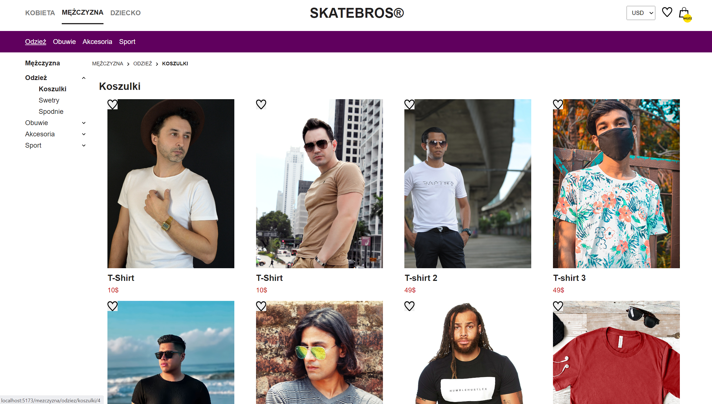
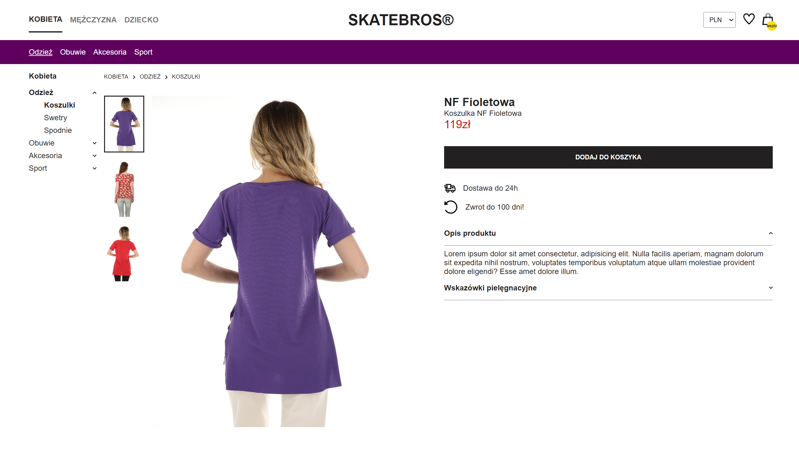
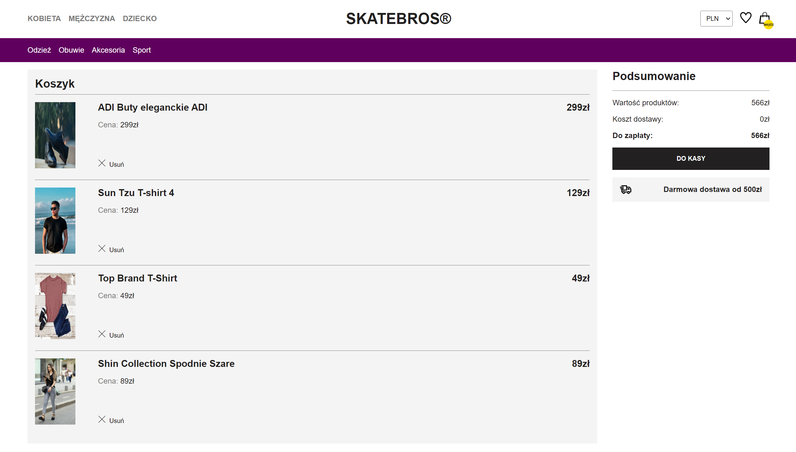

# SKATEBROS

## Screenshots

    </img>
     
    </img>
     
    </img>
     
    </img>

## Description

-   Desktop type website of a (hypothetical) Gym called "SKATEBROS"!
-   Website contains three main gender-based categories: Kobieta, Mężczyzna, Dziecko. Each gender category contains few subcategories, such as: Odzież, Obuwie, Akcesoria, Sport. Then again, each of these categories contains few more categories to chose from.
-   The user can add the selected product to "favorites" by clicking the heart icon.
-   When clicking on the image of the product, special subpage will appear, with the information about selected product, its price and also ability to see other images of selected product. On top of that, there will be a button that will move selected product to the Cart.
-   In the menu, when selecting categories and subcategories, there will always be visible breadcrumbs that are helping user to navigate throuh page. (Breadcrumbs are right below the purple label categories section).

#### Technology used:

-   React
-   React-Router-Dom
-   React module styled components
-   Framer Motion - Animations
-   E2E and Unit Tests
-   Properly functioning Back-End

## What I Learned

-   Using most important **SEO tags** in modern websites.
-   Mastering routing with React-Router-Dom library.
-   Creating properly working Breadcrumbs on website.
-   How to control state in contexts in bigger project using best practices.
-   Using react modules styles.
-   Creating little Back-End database for the project.
-   Working with Back-End on React Contexts and Maintaining website states with local storage.
-   Creating advanced animations with library Framer Motion
-   Destructuring project to the smallest components.
-   Creating both E2E and Unit Tests.

## Author info

-   **Name:** Filip Bereszyński
-   **Age:** 22 years old
-   **Contact:**
    -   bereszynski.filip@gmail.com
    -   (+48) 510 240 074
